# 领域模型（G02.1）

本文描述 Jelee 保留的领域对象、它们在 PostgreSQL 中的主要数据表，以及表之间的外键关系。内容以迁移 `internal/adapter/postgres/migrations/` 执行到最新版本后的实际 schema 为准；下方 ER 图中的每一条关系、每个列名，以及关系两端的基数，都由守门测试 `TestDomainModelDocumentMatchesSchema`（`internal/adapter/postgres/domain_model_doc_test.go`）在真实 PostgreSQL 上逐一核对。图中出现的表之间如果还有未画出的外键，测试同样会失败。

需求原文：

> G02.1 保留域：Movie、Series、Season、Episode、HomeVideo/其他视频、Collection、Playlist、Library、MediaSource、UserData、PlaybackProgress。

PostgreSQL 是唯一的持久状态（见 [ADR 0005](adr/0005-postgresql-only-state.md)）；迁移版本策略（确切版本匹配、已发布迁移不可修改）见 [ADR 0006](adr/0006-migration-version-policy.md)。各表的创建者、清理者与能否重建见[存储布局](storage-layout.md)。

## 领域对象与数据表

| 领域对象 | 主要数据表 | 说明 | 详细文档 |
| --- | --- | --- | --- |
| Library（媒体库） | `libraries`、`library_roots` | 一个媒体库可以有多个根目录。`libraries` 同时保存探测、NFO、盘点的世代号和元数据语言偏好 | [目录同步](catalog-sync.md)、[文件系统扫描](scanning-filesystem.md) |
| Movie、Series、Season、Episode、HomeVideo | `items`（`kind` 列）、`item_parent_links` | 五种条目放在同一张表，`kind` 的 CHECK 约束只接受这五个值。`HomeVideo` 就是需求里的“其他视频”。层级关系另存于 `item_parent_links`：Season 的父项必须是 Series，Episode 的父项可以是 Series 或 Season；父子必须在同一媒体库 | [目录 API](catalog-api.md)、[导入的视频类型](import-video-kinds.md) |
| 条目元数据 | `item_metadata_state`、`item_metadata_fields`、`item_metadata_facts` | 字段值、来源（扫描、NFO、TMDB、手动）和字段锁。`items` 只存标题与类型，其余元数据都在这三张表 | [条目元数据](item-metadata.md)、[NFO 兼容性](nfo-compatibility.md) |
| MediaSource（媒体源/版本） | `media_sources`、`item_primary_versions`、`media_sidecar_tracks` | 一个条目可以有多个版本（多个文件）。`item_primary_versions` 记录主版本，外挂字幕和音轨挂在媒体源下。媒体源只记录根目录加相对路径，不存绝对路径 | [条目版本](item-versions.md)、[媒体元数据](media-metadata.md) |
| 图片 | `item_images` | 每个条目每种图片类型的槽位，以及来源（local/nfo/remote/embedded）和锁定状态 | [图片资产](image-assets.md) |
| Collection（合集） | `collections`、`collection_items` | 由管理员维护，成员可以是 Movie、Series、HomeVideo | [合集与播放清单](collections-playlists.md) |
| Playlist（播放清单） | `playlists`、`playlist_items` | 属于某个用户，成员可以是 Movie、Episode、HomeVideo，同一条目可以重复出现，按 `position` 排序 | [合集与播放清单](collections-playlists.md) |
| UserData（用户数据） | `user_item_data` | 每个用户对每个**逻辑条目**的续播点、已播放标记、播放次数、最后播放的版本。进度属于条目而不属于文件，同一条目的所有版本共用一份 | [播放会话与进度](playback-progress.md) |
| PlaybackProgress（播放进度） | `playback_sessions`、`playback_samples` | 一次播放会话，以及会话中保留的进度样本。统计由这两张表汇总 | [播放会话与进度](playback-progress.md)、[观看统计](watch-statistics.md) |
| 用户与权限 | `users`、`sessions`、`library_acl`、`user_item_access_rules`、`share_links` | 账号、会话（只存令牌的 SHA-256 摘要）、媒体库授权、条目级允许/拒绝规则、分享链接。分享访客是一个隐藏的用户（`users.share_id`） | [访问控制](access-control.md)、[权限矩阵](permission-matrix.md)、[安全模型](security-model.md) |

条目类型在不同功能中的适用范围由代码固定：合集成员类型见 `domain.CollectionKinds`，播放清单成员类型见 `domain.PlaylistKinds`（`internal/domain/collections.go`），浏览接口接受的类型见 `internal/domain/catalog_browse.go`。

<!-- item-kinds: Movie Series Season Episode HomeVideo -->

## ER 图

只画出上表各领域对象的主要表；任务、扫描、NFO 写回、忽略规则、Webhook、审计等运行表不在图中，它们的说明见各自的文档。外键是复合键时，标签列出全部外键列，顺序与约束定义一致。

基数约定：左端 `||` 表示外键列不可为空，`|o` 表示外键列可为空（例如删除用户后改为 NULL）；右端 `o{` 表示一个父行可以有多个子行，`o|` 表示外键列上有唯一约束，最多一个子行。

```mermaid
erDiagram
    libraries {
        uuid id PK
        text name
        text metadata_language
    }
    library_roots {
        uuid id PK
        uuid library_id FK
        text path
    }
    items {
        uuid id PK
        uuid library_id FK
        text kind
        text title
    }
    item_parent_links {
        uuid item_id PK
        uuid library_id FK
        text item_kind
        uuid parent_id FK
        text parent_kind
    }
    media_sources {
        uuid id PK
        uuid item_id FK
        uuid library_id FK
        uuid root_id FK
        text relative_path
        text content_type
    }
    item_primary_versions {
        uuid item_id PK
        uuid library_id FK
        uuid source_id FK
    }
    media_sidecar_tracks {
        uuid id PK
        uuid source_id FK
        uuid library_id FK
        uuid root_id FK
        text kind
        text format
    }
    item_images {
        uuid id PK
        uuid item_id FK
        uuid library_id FK
        text image_type
        integer image_index
        text source_kind
        uuid root_id FK
        boolean locked
    }
    item_metadata_state {
        uuid item_id PK
        integer revision
    }
    item_metadata_fields {
        uuid item_id FK
        text field
        text value
        text source
        boolean locked
    }
    item_metadata_facts {
        uuid item_id FK
        text field
        jsonb value
        text source
        boolean locked
    }
    collections {
        uuid id PK
        text name
        text nfo_name
        uuid created_by FK
    }
    collection_items {
        uuid collection_id FK
        uuid item_id FK
    }
    playlists {
        uuid id PK
        uuid owner_id FK
        text name
        boolean public
    }
    playlist_items {
        uuid id PK
        uuid playlist_id FK
        uuid item_id FK
        integer position
    }
    users {
        uuid id PK
        text name
        boolean is_admin
        boolean disabled
        uuid share_id FK
    }
    sessions {
        uuid id PK
        uuid user_id FK
        bytea token_hash
        text client_kind
    }
    library_acl {
        uuid user_id FK
        uuid library_id FK
    }
    user_item_access_rules {
        uuid user_id FK
        uuid item_id FK
        text effect
    }
    user_item_data {
        uuid user_id FK
        uuid item_id FK
        bigint resume_ticks
        boolean played
        integer play_count
        uuid last_source_id FK
    }
    playback_sessions {
        uuid id PK
        uuid user_id FK
        uuid auth_session_id FK
        uuid item_id FK
        uuid library_id FK
        uuid source_id FK
        text state
        bigint position_ticks
    }
    playback_samples {
        uuid session_id FK
        integer seq
        text kind
    }
    share_links {
        uuid id PK
        uuid library_id FK
        uuid item_id FK
        boolean read_only
        boolean allow_playback
        uuid created_by FK
        uuid revoked_by FK
    }

    libraries ||--o{ library_roots : "library_id"
    libraries ||--o{ items : "library_id"
    items ||--o| item_parent_links : "item_id,library_id,item_kind"
    items ||--o{ item_parent_links : "parent_id,library_id,parent_kind"
    items ||--o{ media_sources : "item_id,library_id"
    library_roots ||--o{ media_sources : "root_id,library_id"
    items ||--o| item_primary_versions : "item_id,library_id"
    media_sources ||--o| item_primary_versions : "source_id"
    media_sources ||--o{ media_sidecar_tracks : "source_id,library_id"
    library_roots ||--o{ media_sidecar_tracks : "root_id,library_id"
    items ||--o{ item_images : "item_id,library_id"
    library_roots |o--o{ item_images : "root_id,library_id"
    items ||--o| item_metadata_state : "item_id"
    item_metadata_state ||--o{ item_metadata_fields : "item_id"
    items ||--o{ item_metadata_facts : "item_id"
    users |o--o{ collections : "created_by"
    collections ||--o{ collection_items : "collection_id"
    items ||--o{ collection_items : "item_id"
    users ||--o{ playlists : "owner_id"
    playlists ||--o{ playlist_items : "playlist_id"
    items ||--o{ playlist_items : "item_id"
    users ||--o{ sessions : "user_id"
    users ||--o{ library_acl : "user_id"
    libraries ||--o{ library_acl : "library_id"
    users ||--o{ user_item_access_rules : "user_id"
    items ||--o{ user_item_access_rules : "item_id"
    users ||--o{ user_item_data : "user_id"
    items ||--o{ user_item_data : "item_id"
    media_sources |o--o{ user_item_data : "last_source_id"
    users ||--o{ playback_sessions : "user_id"
    sessions |o--o{ playback_sessions : "auth_session_id"
    items ||--o{ playback_sessions : "item_id,library_id"
    media_sources |o--o{ playback_sessions : "source_id"
    playback_sessions ||--o{ playback_samples : "session_id"
    libraries ||--o{ share_links : "library_id"
    items |o--o{ share_links : "item_id,library_id"
    users |o--o{ share_links : "created_by"
    users |o--o{ share_links : "revoked_by"
    share_links |o--o| users : "share_id"
```



## 关键约束与删除语义

- **媒体库内一致**：`media_sources`、`media_sidecar_tracks`、`item_images`、`item_parent_links`、`playback_sessions`、`share_links` 都用 `(…, library_id)` 复合外键引用条目或根目录，数据库层面保证子行与父行属于同一个媒体库。目录查询的权限过滤器依赖这一点，按 `library_id` 做 SQL 下推（见 [ADR 0003](adr/0003-unified-access-filter-in-sql.md)）。
- **层级类型**：`item_parent_links` 的外键包含 `item_kind`、`parent_kind`，引用 `items(id, library_id, kind)` 上的唯一约束；CHECK 约束限定只允许 Season→Series、Episode→Series/Season 两种父子组合。
- **删除媒体库或条目**：媒体库下的根目录、条目、媒体源、外挂轨、图片、元数据、合集成员、播放清单项目、用户数据、播放会话都随之级联删除。媒体源被删除时，`user_item_data.last_source_id`、`playback_sessions.source_id` 改为 NULL，进度仍保留在条目上。
- **删除用户**：会话、播放清单、媒体库授权、条目规则、用户数据、播放会话级联删除；合集和分享链接的 `created_by`、`revoked_by` 改为 NULL。永久删除账号的完整范围见[用户数据权利](user-data-rights.md)。
- **分享访客**：`users.share_id` 指向分享链接，链接被删除时访客账号一起删除；访客能看到的内容由统一权限过滤器限制在链接范围内。

## 修改本文

新增或修改领域表时，先写迁移，再更新本文的表格与 ER 图，然后运行守门测试：

```sh
JELEE_TEST_DATABASE_URL=… JELEE_REQUIRE_INTEGRATION=true \
  go test -p 1 -count=1 -run TestDomainModelDocument ./internal/adapter/postgres/
```

没有数据库时，测试只检查 ER 图的语法与表名格式，并以 SKIP 标示外键核对未运行；CI 的 PostgreSQL 分片会运行完整核对。
